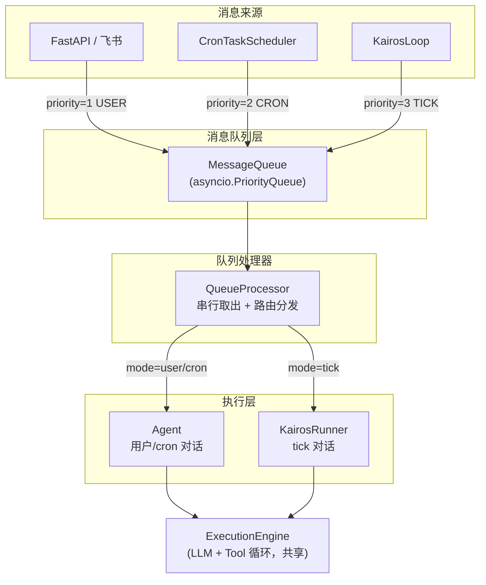
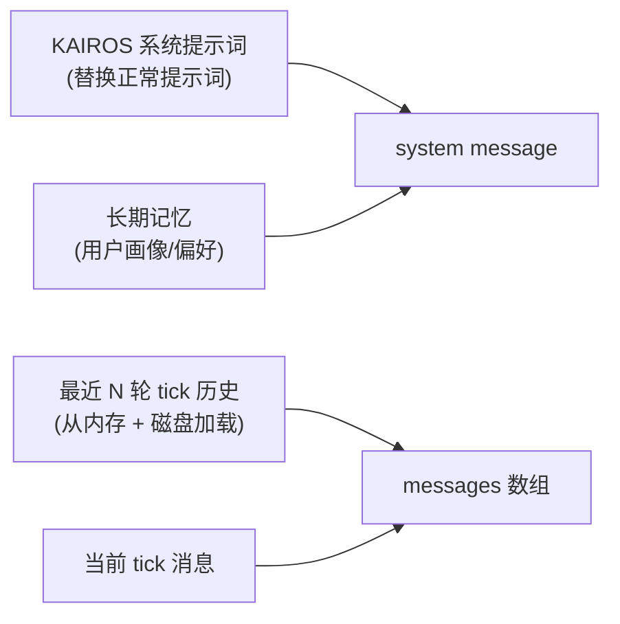

# KAIROS 自治模式实现计划

## 架构总览




**核心原则**：用户消息永远优先于定时任务，定时任务优先于 tick；同一时间只有一个 Agent/KairosRunner 在执行。

---

## 一、消息队列层

### 1.1 消息类型定义

新建 [src/core/queue/types.py](src/core/queue/types.py)

- `MessagePriority` 枚举：`INTERRUPT=0`, `USER=1`, `CRON=2`, `TICK=3`
- `MessageMode` 字符串字面量：`"user"`, `"cron"`, `"tick"`
- `QueueMessage` dataclass：
  - `id: str` — 8 位 hex UUID
  - `priority: int`
  - `mode: str`
  - `content: str` — 消息内容（用户文本 / cron prompt / `<tick>` XML）
  - `chat_id: str` — 用户/cron 消息需要
  - `open_id: str` — 用户消息需要
  - `created_at: float`
  - `_future: asyncio.Future | None` — 用于调用者 await 执行结果

### 1.2 优先级消息队列

新建 [src/core/queue/message_queue.py](src/core/queue/message_queue.py)

- `MessageQueue` 类：
  - 内部用 `asyncio.PriorityQueue`
  - `enqueue(msg) -> Future`：入队，返回 Future 供调用者等待结果
  - `dequeue() -> QueueMessage`：取出最高优先级消息
  - `has_pending() -> bool`：检查队列是否有待处理消息
  - `_wake_event: asyncio.Event`：用于唤醒 KAIROS 的 sleep
  - 入队时自动调用 `_wake_event.set()` 唤醒可能正在 sleep 的 KairosLoop

### 1.3 队列处理器

新建 [src/core/queue/processor.py](src/core/queue/processor.py)

- `QueueProcessor` 类：
  - 构造参数：`queue`, `agent`, `kairos_runner`
  - `run()` 方法：无限循环，`dequeue()` → `_dispatch()` → `future.set_result()`
  - `_dispatch(msg)` 方法：根据 `msg.mode` 路由
    - `"user"` / `"cron"` → `self._agent.run(msg.content, msg.chat_id, msg.open_id)`
    - `"tick"` → `self._kairos_runner.handle_tick(msg)`
  - 异常处理：捕获执行异常，`future.set_exception(e)`，不中断循环
  - 错误熔断：连续 N 次 tick 执行失败时暂停 tick 处理一段时间

---

## 二、KAIROS 执行器

### 2.1 KairosRunner

新建 [src/scheduler/kairos_runner.py](src/scheduler/kairos_runner.py)

**职责**：处理 tick 消息，管理独立上下文，持久化 tick 对话记录。

**构造参数**：

- `llm_registry: LLMServiceRegistry`
- `tool_manager: ToolManager` — 可与 Agent 共享，额外注册 SleepTool
- `scheduler: ToolScheduler`
- `kairos_storage: ShortMemoryStore` — 指向 `kairos/` 目录
- `long_term_memory: LongTermMemoryContext`
- `config: KairosConfig`

**核心方法 `handle_tick(msg) -> str`**：

```
1. 构建上下文 _build_context(msg.content)
2. 获取工具列表（含 SleepTool）
3. 获取 LLM（可配置用 high/medium/low）
4. 调用 ExecutionEngine.run(llm, messages, tools, on_message=回调)
5. 持久化 tick 输入 + LLM 输出到 kairos/ .jsonl
6. 更新内存中的最近 tick 历史
7. 返回 LLM 回复文本
```

**上下文组装 `_build_context(tick_content)` 的组成**：




- system message = KAIROS 系统提示词 + 长期记忆（XML 标签包裹）
- messages = 最近 3 轮 tick 交互历史（最多 6 条消息） + 当前 tick
- **不加载用户短期记忆**

**启动时的历史恢复**：

- 从 `kairos/` 目录加载最新一天的 `.jsonl`
- 取最后 N 条记录作为 `_recent_history`
- 重启后 KAIROS 能接续之前的工作状态

### 2.2 KAIROS 系统提示词

在 [src/scheduler/kairos_runner.py](src/scheduler/kairos_runner.py) 中定义 `KAIROS_SYSTEM_PROMPT` 常量。

关键内容：

- 告知 LLM 它在 KAIROS 自治模式下运行
- 说明 `<tick>` 消息的含义
- 收到 tick 后的行为规则（检查工作 → 有事做就做 → 没事就 Sleep）
- Sleep 时长选择指南（成本控制意识）
- 不要输出无意义的闲聊文字
- 用户消息会被优先处理的说明

### 2.3 对话记录存储

**存储路径**：`~/.heartclaw/skills/memory/kairos/`

**文件布局**（复用 `ShortMemoryStore` 的日期目录结构）：

```
~/.heartclaw/skills/memory/
    short_term/           <- 用户对话（Agent 使用，已有）
        2026-04/
            2026-04-15.jsonl
    kairos/               <- KAIROS 对话（KairosRunner 使用，新增）
        2026-04/
            2026-04-15.jsonl
```

**写入时机**（全部通过 `kairos_storage.append()` 实时写入）：

- tick 输入消息（role=user, source=tick）
- LLM 回复（role=assistant, source=llm）
- 工具调用消息（role=assistant, 含 tool_calls）— 通过 Engine 的 `on_message` 回调
- 工具结果消息（role=tool）— 通过 Engine 的 `on_message` 回调

**格式**：与用户对话完全一致的 `.jsonl`，每行一个 `ContextItem.to_dict()`。

---

## 三、SleepTool

新建 [src/core/tool/tools/sleep/](src/core/tool/tools/sleep/) 目录：

- `__init__.py`
- `definition.py` — `SleepTool` InternalTool 定义
- `executor.py` — `sleep_handler` 执行逻辑

**工具定义**：

- name: `"Sleep"`
- description: 告诉 LLM 这是控制下次醒来时间的工具，说明成本考量
- parameters: `seconds: int`（必填，休息秒数）
- handler: 直接返回成功结果 `ToolResult.ok({"seconds": N})`（实际的 sleep 由 KairosLoop 执行）
- is_read_only: True

**KairosLoop 如何获取 sleep 时长**：

- `handle_tick()` 执行完后，KairosLoop 从 LLM 的回复文本或工具调用记录中提取 Sleep 参数
- 如果 LLM 没调 Sleep → 使用 `config.default_sleep_seconds`
- 对提取到的值做 `min/max` 裁剪

---

## 四、KairosLoop（Tick 循环）

新建 [src/scheduler/kairos_loop.py](src/scheduler/kairos_loop.py)

**职责**：持续产生 tick 消息，控制 sleep 间隔。

```
启动 → 等待 5s（让其他服务就绪）
    → 构造 tick 消息 <tick>YYYY-MM-DD HH:MM:SS</tick>
    → enqueue(priority=TICK)
    → await future（等待 QueueProcessor 处理完）
    → 从结果提取 sleep 秒数
    → 可被打断的 sleep（asyncio.wait_for + wake_event）
    → 循环
```

**可打断 sleep 机制**：

- 使用 `MessageQueue._wake_event`
- 当有 USER/CRON 消息入队时，`wake_event.set()` 唤醒 sleep
- 唤醒后不立即发 tick，而是等队列中的高优先级消息处理完后再发下一个 tick
- 具体做法：唤醒后检查 `queue.has_pending()`，如果有则不入队 tick，直接进入下一轮 sleep

---

## 五、现有模块改造

### 5.1 [src/api/routes/chat.py](src/api/routes/chat.py)

**改造内容**：不再直接调用 `Agent.run()`，改为入队 + 等结果

- 去掉 `_agent_lock` 相关代码（`set_agent_lock`, `async with _agent_lock`）
- 新增 `_queue_ref` 和 `set_message_queue(queue)`
- `chat()` 路由改为：构造 `QueueMessage(mode="user", priority=1)` → `enqueue()` → `await future`

### 5.2 [src/scheduler/cron_scheduler.py](src/scheduler/cron_scheduler.py)

**改造内容**：`_on_fire` 不再直接调 `Agent.run()`，改为入队

- 构造参数：去掉 `agent` 和 `agent_lock`，改为 `queue: MessageQueue`
- `_on_fire()` 改为：构造 `QueueMessage(mode="cron", priority=2)` → `enqueue()` → `await future`

### 5.3 [src/main.py](src/main.py)

**改造内容**：

- 去掉 `asyncio.Lock` 创建和 `set_agent_lock()` 调用
- 新增创建 `MessageQueue`
- 新增创建 `ShortMemoryStore(base_dir=kairos_memory_dir)` 给 KAIROS 使用
- 新增创建 `KairosRunner`
- 新增创建 `QueueProcessor`，`asyncio.create_task(processor.run())`
- 改造 `CronTaskScheduler` 的构造参数（传 queue 而非 agent+lock）
- 读取 `settings.kairos.enabled`，条件创建 `KairosLoop`
- 新增 `set_message_queue(queue)` 给 chat.py

### 5.4 [src/config/settings.py](src/config/settings.py)

**改造内容**：

- 新增 `KairosConfig` dataclass：
  - `enabled: bool = True`
  - `default_sleep_seconds: int = 300`
  - `max_sleep_seconds: int = 3600`
  - `min_sleep_seconds: int = 30`
- `AppConfig` 新增 `kairos: KairosConfig` 字段
- `_build_config()` 新增解析 `kairos` 段
- `AppConfig` 新增 `kairos_memory_dir` 属性，返回 `~/.heartclaw/skills/memory/kairos/`
- `ensure_heartclaw_dirs()` 新增创建 `kairos/` 目录

### 5.5 [src/core/agent/agent.py](src/core/agent/agent.py)

**不做改动**。Agent 类保持原样，QueueProcessor 直接调用 `agent.run()`。

---

## 六、config.json 变更

在 `_DEFAULT_CONFIG_TEMPLATE` 中新增 `kairos` 段：

```json
{
  "kairos": {
    "enabled": true,
    "default_sleep_seconds": 300,
    "max_sleep_seconds": 3600,
    "min_sleep_seconds": 30
  }
}
```

用户可在 `~/.heartclaw/config.json` 中设置 `"enabled": false` 关闭 KAIROS。

---

## 七、新增文件清单


| 文件                                        | 说明                               |
| ----------------------------------------- | -------------------------------- |
| `src/core/queue/__init__.py`              | 模块导出                             |
| `src/core/queue/types.py`                 | QueueMessage, MessagePriority 定义 |
| `src/core/queue/message_queue.py`         | 优先级消息队列                          |
| `src/core/queue/processor.py`             | 队列处理器（路由分发）                      |
| `src/scheduler/kairos_loop.py`            | Tick 循环生成器                       |
| `src/scheduler/kairos_runner.py`          | KAIROS 专用执行器 + 系统提示词             |
| `src/core/tool/tools/sleep/__init__.py`   | SleepTool 模块                     |
| `src/core/tool/tools/sleep/definition.py` | SleepTool 定义                     |
| `src/core/tool/tools/sleep/executor.py`   | SleepTool 执行逻辑                   |


## 八、改造文件清单


| 文件                                | 改动概要                                       |
| --------------------------------- | ------------------------------------------ |
| `src/config/settings.py`          | 新增 KairosConfig + kairos_memory_dir + 目录创建 |
| `src/main.py`                     | 去 Lock，加 Queue/Processor/KairosLoop        |
| `src/api/routes/chat.py`          | 改为入队模式                                     |
| `src/scheduler/cron_scheduler.py` | 改为入队模式                                     |


---

## 九、实现顺序

建议按以下顺序分步实现，每步完成后可独立验证：

1. **Step 1**：config.json + settings.py（KairosConfig 配置基础）
2. **Step 2**：消息队列层（types + message_queue + processor）
3. **Step 3**：改造 chat.py + cron_scheduler.py + main.py（接入队列）— 此步完成后现有功能应全部正常
4. **Step 4**：SleepTool
5. **Step 5**：KairosRunner（独立执行器 + 上下文 + 存储）
6. **Step 6**：KairosLoop（tick 循环）
7. **Step 7**：集成到 main.py，完整联调

