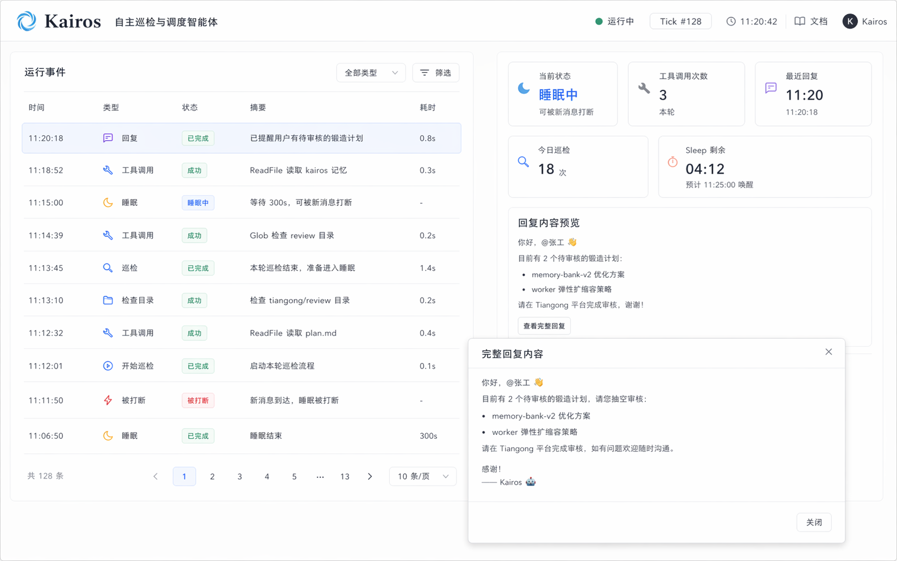

# HeartClaw Web 控制台 -- Kairos 前端样式设计

## 一、设计目标

Kairos 页面不适合继续沿用“系统日志页”的表达方式。

虽然 Kairos 的底层运行中确实会产生日志、工具调用和状态变化，但从用户视角看，它更像一个持续自治运行的巡检代理。用户真正关心的不是原始日志本身，而是：

- 当前 Kairos 正处于什么状态
- 最近做了哪些动作
- 有没有调用工具
- 有没有给出回复
- 是否已经进入睡眠
- 睡眠有没有被新消息打断

因此，这个页面的目标不是做成“另一个天工日志页”，而是做成一个更克制、更直观的**自治运行状态页**。

这次已经确认的方向如下：

- 保持 HeartClaw 当前白底、浅灰分层、轻状态色的产品风格
- 主体采用两列布局，而不是复杂的会话卡片墙
- 左侧以高密度长方形事件列表为主，方便快速扫视
- 右侧只保留状态统计和简要回复预览，不堆叠冗长详情
- 完整回复内容通过弹窗查看，避免主界面被长文本挤占

这套设计的重点不是“更炫”，而是让 Kairos 的状态流更容易被理解和跟踪。

---

## 二、页面定位

### 1. Kairos 页面是什么

Kairos 页面是 HeartClaw 中展示自治巡检流程的页面。

它和其他页面的定位区别应当明确：

- 如意页面：用户对话与工具执行过程
- 天工页面：系统运行日志与工坊状态
- 卷宗页面：配置与规则编辑
- Kairos 页面：自治巡检、工具调用、回复输出、睡眠节奏的可视化

也就是说，Kairos 更接近“运行轨迹浏览页”，而不是“原始日志输出页”。

### 2. 页面要解决的问题

用户打开 Kairos 页面时，应该可以在短时间内知道：

- 当前有没有在巡检
- 最近一次巡检做了什么
- 本轮调用了几个工具
- 最近有没有产生对用户的回复
- 当前是不是在 sleep
- sleep 剩余大概多久

如果这些问题需要通过阅读大量日志才能得出，那么这个页面就没有真正发挥作用。

---

## 三、页面结构

### 1. 总体布局

Kairos 页面采用明确的两列结构：

```text
+---------------------------------------------------------------+
| 页面标题 + 页面说明                                             |
+--------------------------------------+------------------------+
| 左侧：事件列表                          | 右侧：状态统计 + 预览     |
|                                      |                        |
| 时间 | 类型 | 状态 | 摘要 | 耗时        | 当前状态               |
| ...                                  | 工具调用次数            |
| ...                                  | 最近回复时间            |
| ...                                  | 今日巡检次数            |
| ...                                  | Sleep 剩余              |
|                                      |                        |
|                                      | 回复内容预览            |
|                                      | [查看完整回复]          |
+--------------------------------------+------------------------+
```

建议宽度比例：

- 左侧主列表：约 `65%`
- 右侧信息区：约 `35%`

这样做的原因很直接：

- 左侧承担高频浏览任务，需要更大空间
- 右侧承担摘要查看和低频展开，不需要太宽

### 2. 主次关系

这个页面的主次关系必须稳定：

- 主角是左侧事件流
- 辅助是右侧状态概览
- 深度查看通过弹窗完成

右侧不能做成大而全的审计详情区，否则会破坏整页节奏。

---

## 四、左侧事件列表设计

### 1. 列表形式

左侧不采用厚重卡片，也不采用终端日志行，而是采用更接近现代 SaaS 列表的**长方形扁平事件行**。

每一条事件行高度应接近常规表格行高度，但比传统后台表格略舒展一点，方便容纳状态标签和摘要信息。

视觉特点：

- 白底或极浅灰底
- 细边框或细分割线
- 悬停有轻微底色变化
- 选中项使用非常克制的高亮背景
- 不使用大面积重色块

### 2. 建议字段

左侧列表固定展示这五列：

- `时间`
- `类型`
- `状态`
- `摘要`
- `耗时`

这样既足够清晰，也不会像日志页那样难扫。

### 3. 类型设计

类型建议控制在少数几个高频值，避免变成自由文本：

- `巡检`
- `工具调用`
- `回复`
- `睡眠`
- `中断`

这些类型已经能覆盖 Kairos 用户最关心的主体行为。

### 4. 状态设计

状态推荐使用轻量标签，而不是厚重 badge。建议值：

- `已完成`
- `执行中`
- `成功`
- `睡眠中`
- `被打断`
- `失败`

颜色建议：

- 成功/已完成：青绿色
- 执行中：偏蓝或中性深灰
- 睡眠中：琥珀偏暖
- 被打断：橙色
- 失败：红色

### 5. 摘要写法

摘要必须是“人一眼就懂”的短句，而不是原始技术日志。

推荐示例：

- `已提醒用户有待审核的锻造计划`
- `ReadFile 读取 kairos 记忆`
- `Glob 检查 review 目录`
- `等待 300s，可被新消息打断`
- `本轮巡检结束，准备进入睡眠`

不推荐直接展示：

- 原始 JSON
- 过长路径
- 低层级调度细节
- 不可读的内部状态码

### 6. 选中交互

点击某一行后，右侧信息区更新为该条事件对应的简要预览。

选中规则建议：

- 当前选中行保持轻微高亮
- 高亮以浅灰或浅青绿为主
- 不要使用过重边框
- 切换选中时动效非常轻，避免花哨

---

## 五、右侧信息区设计

### 1. 设计原则

右侧信息区不是“详情页”，而是“辅助理解区”。

之前已经明确不走“右边堆大量参数、工具输出、结构化详情”的路线，因为那样会显得啰嗦，也会压缩主列表的价值。

右侧只保留两个模块：

- 状态统计
- 回复内容预览

### 2. 状态统计模块

状态统计放在右侧顶部，用较小的统计卡片或栅格信息块展示。

建议包含：

- `当前状态`
- `工具调用次数`
- `最近回复`
- `今日巡检`
- `Sleep 剩余`

示例：

- 当前状态：`睡眠中`
- 工具调用次数：`3`
- 最近回复：`11:20`
- 今日巡检：`18`
- Sleep 剩余：`04:12`

这些信息的意义：

- 用户进入页面后，能立刻判断系统是不是健康运行
- 不需要先点具体事件，就能建立全局感知

### 3. 回复内容预览模块

右侧下半部分只保留一个小型“回复内容预览”区。

这里的目标不是完整阅读，而是帮助用户快速判断：

- 最近这条回复是不是我想看的
- 要不要点开完整内容

因此建议只展示：

- 标题：`回复内容预览`
- 2 到 4 行正文预览
- 一个轻量按钮：`查看完整回复`

如果当前选中项不是回复类型，也不需要把右侧塞满工具细节。可以显示一句简单说明，例如：

- `当前选中项为工具调用，暂无回复正文`
- `当前选中项为睡眠事件，Kairos 已进入可中断 sleep`

### 4. 为什么不展示冗长详情

这是本次设计收敛的关键。

如果右侧展示：

- 工具参数
- 工具输出
- 状态链路
- 调度上下文
- 大段回复正文

那么页面会很快回到“信息过载”的问题。

Kairos 页面应该优先服务“扫视”和“理解状态”，而不是强迫用户在主界面深入读所有内容。

---

## 六、完整回复弹窗设计

### 1. 弹窗的作用

完整回复内容不适合长期停留在主界面，因此需要通过弹窗承接。

弹窗只在用户主动点击 `查看完整回复` 时打开。

### 2. 弹窗内容

弹窗内建议包含：

- 标题：如 `完整回复`
- 回复时间
- 回复正文
- 关闭按钮

必要时可以补一个复制按钮，但不必在第一版设计里强调。

### 3. 视觉原则

弹窗应保持和整页一致的克制风格：

- 白底
- 细边框
- 适度圆角
- 背后加浅色遮罩
- 不使用过深阴影

正文区域要保证：

- 行高舒适
- 段落清晰
- 中文长文本可读

### 4. 使用节奏

弹窗是低频深读入口，不应取代主界面。

这意味着：

- 平时用户主要停留在列表和右侧摘要
- 需要阅读全文时才打开弹窗
- 关闭后能快速回到原来的事件上下文

---

## 七、视觉规则

### 1. 视觉方向

Kairos 页面延续当前 HeartClaw Web 已确认的整体设计语言：

- 白底为主
- 浅灰分层
- 细边框
- 小面积状态色
- 产品感优先于“终端感”

### 2. 色彩建议

可继续沿用现有主站风格中的中性色和青绿色系，并补充少量状态色：

```css
--bg-page: #ffffff;
--bg-panel: #fbfcfc;
--bg-soft: #f5f7f7;

--border-subtle: #edf1f1;
--border-default: #dde5e5;

--text-primary: #1f2937;
--text-secondary: #5f6b76;
--text-muted: #8a96a3;

--accent-success: #1f9d8b;
--accent-running: #4b7bec;
--accent-sleep: #d18b1f;
--accent-interrupt: #d97706;
--accent-error: #dc4c3f;
```

### 3. 排版建议

- 页面标题清晰直接，不要过度包装
- 列表字段文字偏紧凑，但不能压到难读
- 摘要文字优先可读性，而不是对齐形式主义
- 回复预览和弹窗正文采用更舒展的排版

### 4. 组件气质

整个页面应该像“成熟产品中的一个稳定管理页”，而不是展示型概念稿。

所以要避免：

- 复杂渐变
- 过多发光效果
- 大面积毛玻璃
- 过度动效
- 复杂三栏或四栏信息堆叠

---

## 八、Kairos 页面视觉稿

下面这张图是本次确认方向的 Kairos 页面视觉稿：



这张稿已经体现了本次确认的几个关键点：

- 左侧高密度事件列表
- 右侧简洁状态统计
- 小面积回复预览
- 完整回复通过弹窗查看

它不再强调“单独 tick 会话”的概念，而是直接围绕运行事件本身组织页面，这更符合 Kairos 的真实使用方式。

---

## 九、后续实现建议

为了把这份设计顺利落地，建议按下面的顺序推进：

1. 先定义 Kairos 前端事件模型  
   明确前端需要接收哪些事件类型，例如：巡检、工具调用、回复、睡眠、中断。

2. 补齐后端结构化事件输出  
   不建议直接复用原始日志流，而应通过 WebSocket 推送更适合展示的事件对象。

3. 先实现左侧事件列表  
   把主页面骨架和列表选中逻辑搭起来，优先解决“能读、能点、能筛选”。

4. 再补右侧状态统计和回复预览  
   先把核心指标显示出来，再接选中项预览。

5. 最后实现完整回复弹窗  
   作为补充交互，不要反过来主导页面结构。

如果后续要继续扩展，也建议始终坚持这条原则：

**Kairos 页面优先展示自治运行的状态流，而不是堆积原始技术细节。**
