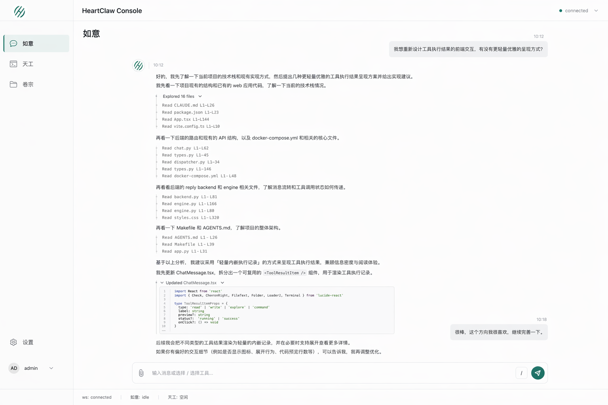
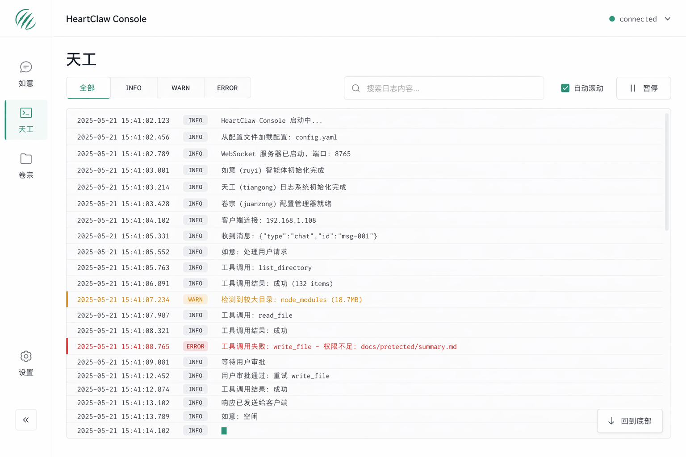
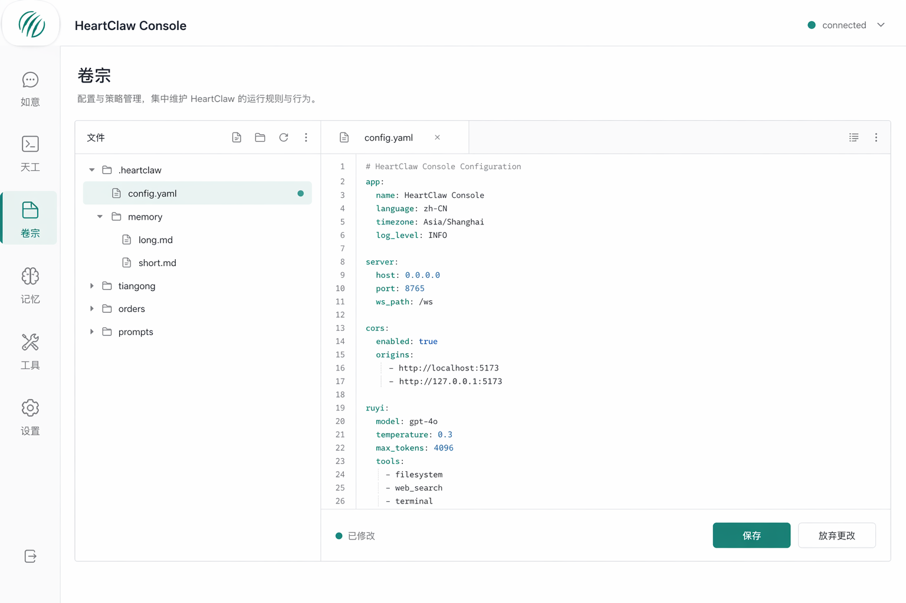

# HeartClaw Web 控制台 -- 前端样式设计

## 一、设计目标

这版前端样式不再沿用之前的深色工坊风格，而是切换为更克制、更现代的产品界面语言。

本次已经确认的设计方向：
- **极简产品感**，参考 Linear / Notion / Vercel 这类产品的秩序感和克制感
- **白色打底**，以浅灰分层代替深色大底
- **青绿色点缀**，只用于激活态、连接状态、主按钮和少量强调信息
- **信息密度适中**，页面要看起来像真实可用产品，而不是过度留白的概念稿
- **现代无衬线字体**，整体要纯净、直接、专业

这套方向的目标不是做成“装饰感很强的设计稿”，而是输出一套可以继续落地为真实前端页面的视觉规范。

---

## 二、全局设计系统

### 1. 页面气质

- 视觉关键词：干净、克制、清晰、专业、可持续使用
- 页面底色：纯白或接近白色的浅底
- 面板层级：主要通过极浅灰背景、细边框、间距和模块分区来体现
- 强调方式：尽量不用大面积强调色，用小面积青绿色完成状态表达

### 2. 基础色彩建议

```css
--bg-page: #ffffff;
--bg-panel: #fbfcfc;
--bg-muted: #f5f7f7;
--bg-soft-accent: #eef7f5;

--border-subtle: #edf1f1;
--border-default: #dde5e5;

--text-primary: #1f2937;
--text-secondary: #5f6b76;
--text-muted: #8a96a3;

--accent-primary: #1f9d8b;
--accent-primary-soft: #dff3ef;
--accent-success: #1f9d8b;
--accent-warning: #d18b1f;
--accent-error: #dc4c3f;
```

### 3. 字体和排版

- 页面标题：现代无衬线，大字号，字重偏中高
- 正文说明：中等字重，控制段落长度，避免太散
- 日志和代码：只在需要的局部使用等宽字体
- 文件名、路径、代码标识：轻量 `code` 风格，不做过重标签化

### 4. 全局布局规则

统一采用以下骨架：

```text
+----------------+-----------------------------------+
| 侧边栏导航       | 顶部栏 + 当前页面内容                |
|                |                                   |
| 如意 / 天工 / 卷宗 | 根据路由切换不同主页面               |
|                |                                   |
+----------------+-----------------------------------+
| 底部状态栏                                           |
+----------------------------------------------------+
```

统一约束：
- 侧边栏负责导航和全局定位
- 顶部栏显示产品名和连接状态
- 内容区保持稳定左右边距和统一网格
- 底部状态栏显示轻量级运行状态，不干扰主体阅读

---

## 三、如意前端样式

### 1. 页面定位

如意页面是对话中心，因此重点不是“炫酷聊天气泡”，而是让用户在阅读对话、理解过程、查看执行结果时都保持顺畅。

### 2. 页面结构

- 左侧为全局导航
- 顶部显示 `HeartClaw Console` 和连接状态
- 中间为聊天消息流
- 底部为消息输入区和发送按钮
- 最底部为运行状态条

### 3. 聊天视觉原则

用户消息：
- 右对齐
- 很浅的灰色气泡
- 视觉存在感轻，不抢主内容

助手消息：
- 左对齐
- 更接近正文容器，而不是厚重卡片
- 重点是可读性和信息层级

### 4. 工具执行结果交互规范

这一页最核心的设计更新，是把工具调用从“独立卡片”改成**嵌入正文的工具执行结果流**。

已经确认的规则如下：

- 工具记录直接嵌在助手消息正文里
- 默认展示的是“摘要层”，不是全部结果层
- 读取类工具只显示做了什么
- 写入类工具默认显示写入位置和局部代码片段预览
- 点击写入类工具后，可以展开查看更多执行结果
- 展开内容以代码片段为主，不强调 diff 视觉
- 整体排版参考 Cursor 的轻量过程展示，而不是传统日志卡片

读取类工具示意：

```text
Explored 16 files
Read App.tsx L1-L144
Read backend.py L1-L81
Read styles.css L1-L320
```

写入类工具示意：

```text
Updated ChatMessage.tsx
<ToolResultItem type="write" label="Updated ChatMessage.tsx" />
```

展开后的详细内容以局部代码片段预览为主，例如：

```tsx
<ToolResultItem
  type="write"
  label="Updated ChatMessage.tsx"
>
  <code>const previewLines = result.preview?.slice(0, 4)</code>
  <code>return &lt;ToolResultBlock lines={previewLines} /&gt;</code>
</ToolResultItem>
```

### 5. 视觉处理建议

- 工具记录和正文左对齐
- 只保留极淡的结构线，帮助区分“说明”与“执行记录”
- 不使用厚重边框和大块状态 badge
- 写入类工具预览像“嵌入正文中的代码引用块”
- 状态存在，但必须弱化，避免抢走正文注意力

### 6. 如意页面视觉稿



---

## 四、天工前端样式

### 1. 页面定位

天工页面负责展示系统运行日志，因此要保留“开发者工具感”，但不能退回到传统黑底终端。这里的目标是：在白底产品界面里，仍然让日志阅读有足够清晰的节奏和密度。

### 2. 页面结构

- 顶部为页面标题
- 标题下方是日志筛选和控制工具栏
- 中间为主日志流面板
- 面板底部保留实时连接中的细微信号，例如光标块

### 3. 交互规范

- 日志级别提供 `全部 / INFO / WARN / ERROR` 过滤
- 支持自动滚动和暂停
- 用户向上滚动后，可以通过“回到底部”快速回到最新日志
- 日志行采用清晰的三段式结构：时间、级别、消息

### 4. 视觉规则

- 页面仍然是白底和浅灰面板
- INFO 弱化显示，避免视觉拥挤
- WARN 使用偏琥珀色提示
- ERROR 使用红色强调，并用极细左侧标识线增强识别
- 日志使用等宽字体，但不让整页都变成终端风格

### 5. 天工页面视觉稿



---

## 五、卷宗前端样式

### 1. 页面定位

卷宗页面是配置与规则管理中心，因此它既要像编辑器，又不能完全变成 IDE。目标是保持“管理界面”的清晰度，同时给出足够稳定的编辑体验。

### 2. 页面结构

- 左侧为文件树
- 右侧为主编辑区
- 顶部显示当前文件名
- 底部为保存状态与操作按钮

### 3. 交互规范

- 文件树要清晰展示目录层级和当前选中状态
- 编辑区需要接近 Monaco 的使用体验，但视觉继续维持白底体系
- 当前文件修改后，底部状态区显示“已修改”
- 提供主操作按钮“保存”和次操作“放弃更改”

### 4. 视觉规则

- 当前选中文件使用极浅的青绿色背景提示
- 编辑区主体使用白底，细边框包裹
- 代码仅在局部使用语法高亮，不做强烈编辑器色彩
- 保存栏需要清晰，但不能像后台管理系统那样很重

### 5. 卷宗页面视觉稿



---

## 六、后续实现建议

为了让这份样式设计顺利落地，前端实现阶段建议按下面顺序推进：

1. 先建立新的白底主题变量和页面基础布局
2. 统一实现侧边栏、顶部栏、底部状态栏三块公共区域
3. 优先实现如意页面，因为它的工具执行结果样式最特殊，也最能定义产品气质
4. 再实现天工日志页，把过滤、自动滚动和状态显示补齐
5. 最后实现卷宗页面，把文件树、编辑器和保存反馈补全
6. 在页面骨架稳定后，再接入真实 WebSocket 数据和后端响应流

---

## 七、当前成果

本次已经完成：
- 明确新的前端视觉方向
- 生成三张核心页面视觉稿
- 确认如意页面的工具执行结果交互规则
- 将设计说明和图片整理为独立文档目录

当前文档目录结构：

```text
docs/Components/前端样式设计/
├── web_前端样式设计.plan.md
└── images/
    ├── 如意前端样式.png
    ├── 天工前端样式.png
    └── 卷宗前端样式.png
```
